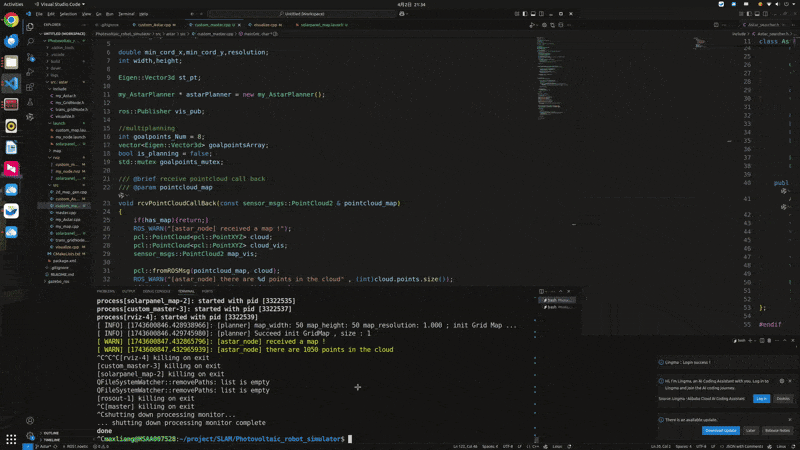

## 2D A*

### 安装依赖

```
rosdep install --from-path src --ignore-path -r -y
```

### 运行

```
source devel/setup.bash
## custom map 10*10
roslaunch astar custom_map.launch
## slam map 4000*4000
roslaunch astar my_node.launch
```

### 多路标点

输入多个路标点，分别作为起点与终点规划

`roslaunch astar solarpanel_map.launch`


