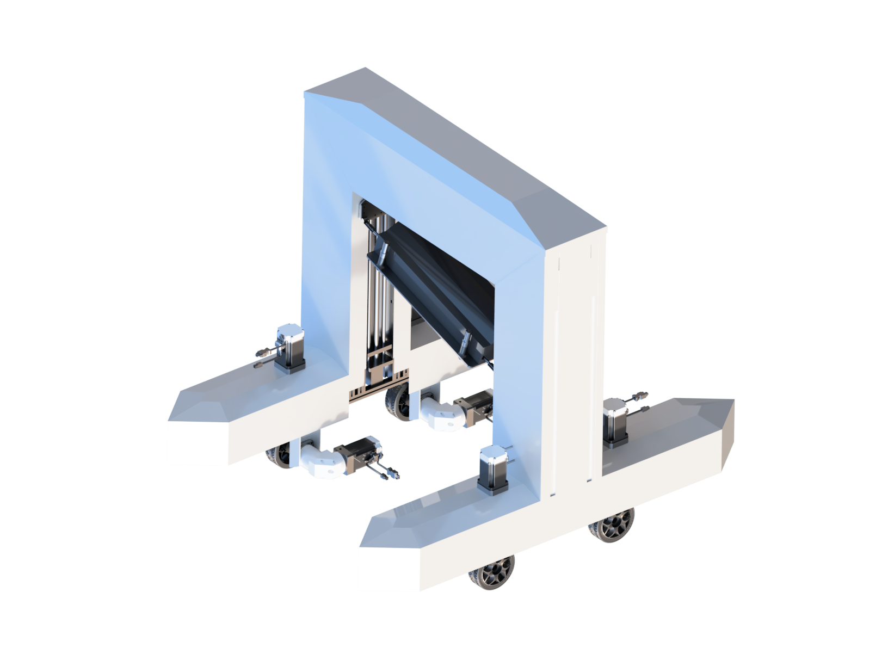

# Photovoltaic_robot_simulator

> **光伏清洁机器人仿真平台**



## 一、安装依赖
... waiting for update!

## 二、使用说明

### 1. 测试启动流程

> 详细启动指令参见scripts/run.sh 

**开启gazebo仿真环境**
```bash
source devel/setup.bash
roslaunch robot_description gazebo.launch
```

**开启小车控制节点**
```bash
source devel/setup.bash
roslaunch robot_control velocity_controller.launch 

# new terminal 启动键盘控制
source devel/setup.bash
rosrun teleop_twist_keyboard teleop_twist_keyboard.py
```

**启动slam算法**
```bash
source devel/setup.bash
roslaunch fast_lio_sam mapping_velodyne16_lio_sam_parking_dataset.launch
```

**rviz 建图**
```bash
source devel/setup.bash
rosrun rviz rviz -d $(rospack find fast_lio_sam)/rviz_cfg/loam_livox.rviz
```